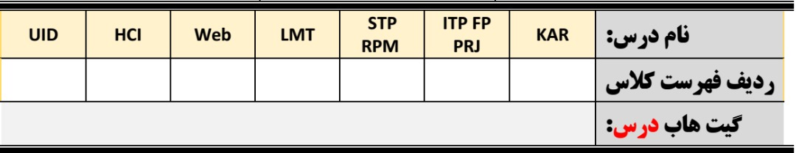
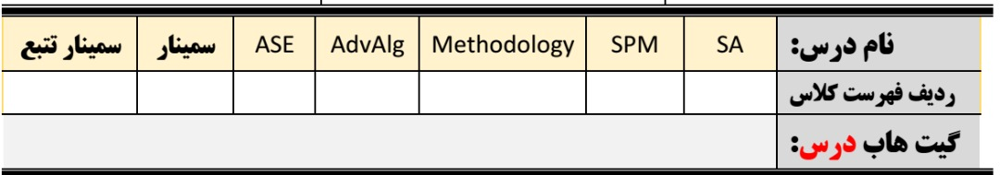

# ارزیابی ترم 3991

# [PNU_3991](https://github.com/AliRazavi-edu/PNU_3991#TOC)

«حاسِبُوا اَنْفُسَکُم قبلَ اَن تُحاسَبُوا و زِنُواها قبلَ اَنْ تُوزَنُوا و تَجَهَّزُوا لِلْعَرْضِ الاَْکْبَر»

خویشتن را محاسبه کنید قبل از آنکه به حساب شما برسند و خویش را وزن کنید قبل از آنکه شما را وزن کنند و آماده شوید براى عرضه بزرگ (روز قیامت).

## فهرست
- [**آمار میزان مشارکت ها در گیت هاب ترم**](#Assessment-Notes)
- [**فعالیت های مشترک**](#Assessment-General)
- [**دروس کارشناسی**](#Assessment-BSc)
- [**دروس کارشناسی ارشد**](#Assessment-MSc)
- [**سوالات متداول**](#Assessment-FAQ)

## آمار فعالیت دانشجویان در گیت هاب ترم

- [فهرست **دوستاران** سایت دروس 3991](https://github.com/AliRazavi-edu/PNU_3991/stargazers)  **(stargazers)**
- [منحنی مشارکت هر دانشجو](https://github.com/AliRazavi-edu/PNU_3991/graphs/contributors)
- [نمودار فعالیت ها](https://github.com/AliRazavi-edu/PNU_3991/pulse/monthly)

----

> ##  فرم های ارزیابی

    
فعالیت های مشترک

>  [**فعالیت های مشترک**](https://github.com/AliRazavi-edu/PNU_3991/tree/master/_Assessment/_General)
   #### ارزیابی رزومه و انگیزه نامه
   - [PDF](https://github.com/AliRazavi-edu/PNU_3991/blob/master/_Assessment/_General/XX_CV_CheckList_AR_3991.pdf)
   - [Word](https://github.com/AliRazavi-edu/PNU_3991/blob/master/_Assessment/_General/XX_CV_CheckList_AR_3991.docx)
    
   #### خلاصه ارزیابی بخش عمومی
   - [PDF](https://github.com/AliRazavi-edu/PNU_3991/blob/master/_Assessment/_General/XX_GeneralSection_CheckList_AR_3991.pdf)
   - [Word](https://github.com/AliRazavi-edu/PNU_3991/blob/master/_Assessment/_General/XX_GeneralSection_CheckList_AR_3991.docx)
   
  #### نمونه فرمهای ارزیابی تکمیل شده
   - [**ارزیابی رزومه و انگیزه نامه**](https://github.com/saharzeinivand/PNU_3991_AR/blob/main/_General/SZ_CV_CheckList_AR_3991.pdf)
   - [**خلاصه ارزیابی بخش عمومی**](https://github.com/saharzeinivand/PNU_3991_AR/blob/main/_General/SZ_GeneralSection_CheckList_AR_3991.pdf)
   - [**نمونه درس کارشناسی**](https://github.com/mir-mohammad/PNU_3991_AR)
   - [**نمونه درس ارشد**](https://github.com/saharzeinivand/PNU_3991_AR)

[<kbd>↩</kbd>](#TOC)

    
--------

    
دروس کارشناسی

    
>  [**دروس کارشناسی**](https://github.com/AliRazavi-edu/PNU_3991/tree/master/_Assessment/_BSc)
   ### [تعامل انسان و کامپیوتر](https://github.com/AliRazavi-edu/PNU_3991/tree/master/_BSc/HumanComputerInteraction#TOC) 
   - [PDF](https://github.com/AliRazavi-edu/PNU_3991/blob/master/_Assessment/_BSc/XX_HumanComputerInteraction_CheckList_AR_3991.pdf)
   - [Word](https://github.com/AliRazavi-edu/PNU_3991/blob/master/_Assessment/_BSc/XX_HumanComputerInteraction_CheckList_AR_3991.docx)
    
   #### [طراحي واسط كاربر](https://github.com/AliRazavi-edu/PNU_3991/tree/master/_BSc/UserInterfaceDesgin#TOC)
   - [PDF](https://github.com/AliRazavi-edu/PNU_3991/blob/master/_Assessment/_BSc/XX_UserInterfaceDesgin_CheckList_AR_3991.pdf)
   - [Word](https://github.com/AliRazavi-edu/PNU_3991/blob/master/_Assessment/_BSc/XX_UserInterfaceDesgin_CheckList_AR_3991.docx)
   #### [برنامه نويسي وب](https://github.com/AliRazavi-edu/PNU_3991/blob/master/_BSc/WebProgramming/README.md#TOC)
   - [PDF](https://github.com/AliRazavi-edu/PNU_3991/blob/master/_Assessment/_BSc/XX_WebProgramming_CheckList_AR_3991.pdf)
   - [Word](https://github.com/AliRazavi-edu/PNU_3991/blob/master/_Assessment/_BSc/XX_WebProgramming_CheckList_AR_3991.docx)
   
   #### [نظريه زبانهاوماشين ها](https://github.com/AliRazavi-edu/PNU_3991/tree/master/_BSc/Theory-of-Languages-and-Machines#TOC)
   - [PDF](https://github.com/AliRazavi-edu/PNU_3991/blob/master/_Assessment/_BSc/XX_Theory-of-Languages-and-Machines_CheckList_AR_3991.pdf)
   - [Word](https://github.com/AliRazavi-edu/PNU_3991/blob/master/_Assessment/_BSc/XX_Theory-of-Languages-and-Machines_CheckList_AR_3991.docx)
   #### [روش پژوهش و ارائه](https://github.com/AliRazavi-edu/PNU_3991/tree/master/_BSc/ResearchAndPresentationMethods#TOC)
   - [PDF](https://github.com/AliRazavi-edu/PNU_3991/blob/master/_Assessment/_BSc/XX_ResearchAndPresentationMethods_CheckList_AR_3991.pdf)
   - [Word](https://github.com/AliRazavi-edu/PNU_3991/blob/master/_Assessment/_BSc/XX_ResearchAndPresentationMethods_CheckList_AR_3991.docx)
   #### [شيوه ارائه مطالب علمي وفني](https://github.com/AliRazavi-edu/PNU_3991/tree/master/_BSc/ResearchAndPresentationMethods#TOC)
   - [PDF](https://github.com/AliRazavi-edu/PNU_3991/blob/master/_Assessment/_BSc/XX_ResearchAndPresentationMethods_CheckList_AR_3991.pdf)
   - [Word](https://github.com/AliRazavi-edu/PNU_3991/blob/master/_Assessment/_BSc/XX_ResearchAndPresentationMethods_CheckList_AR_3991.docx)
   #### [پروژه فناوري اطلاعات](https://github.com/AliRazavi-edu/PNU_3991/tree/master/_BSc/Project#TOC)
   - [PDF]()
   - [Word]()
   #### [پروژه](https://github.com/AliRazavi-edu/PNU_3991/tree/master/_BSc/Project#TOC)
   - [PDF]()
   - [Word]()
   #### [پروژه پاياني](https://github.com/AliRazavi-edu/PNU_3991/tree/master/_BSc/Project#TOC)
   - [PDF]()
   - [Word]()
   #### [كارآموزي](https://github.com/AliRazavi-edu/PNU_3991/tree/master/_BSc/Internship#TOC)
   - [PDF]()
   - [Word]()

[<kbd>↩</kbd>](#TOC)

---------

    
دروس کارشناسی ارشد

    
>   [**دروس کارشناسی ارشد**]()
   #### [الگوريتم هاي پيشرفته](https://github.com/AliRazavi-edu/PNU_3991/tree/master/_MSc/AdvancedAlgorithms#TOC)
   - [PDF](https://github.com/AliRazavi-edu/PNU_3991/blob/master/_Assessment/_MSc/XX_AdvancedAlgorithms_CheckList_AR_3991.pdf)
   - [Word](https://github.com/AliRazavi-edu/PNU_3991/blob/master/_Assessment/_MSc/XX_AdvancedAlgorithms_CheckList_AR_3991.docx)
   #### [مهندسي نرم افزارپيشرفته](https://github.com/AliRazavi-edu/PNU_3991/tree/master/_MSc/AdvancedSoftwareEngineering#TOC)
   - [PDF](https://github.com/AliRazavi-edu/PNU_3991/blob/master/_Assessment/_MSc/XX_AdvancedSoftwareEngineering_CheckList_AR_3991.pdf)
   - [Word](https://github.com/AliRazavi-edu/PNU_3991/blob/master/_Assessment/_MSc/XX_AdvancedSoftwareEngineering_CheckList_AR_3991.docx)
   #### [معماري نرم افزار](https://github.com/AliRazavi-edu/PNU_3991/tree/master/_MSc/SoftwareArchitecture#TOC)
   - [PDF](https://github.com/AliRazavi-edu/PNU_3991/blob/master/_Assessment/_MSc/XX_SoftwareArchitecture_CheckList_AR_3991.pdf)
   - [Word](https://github.com/AliRazavi-edu/PNU_3991/blob/master/_Assessment/_MSc/XX_SoftwareArchitecture_CheckList_AR_3991.docx)
   #### [متدولوژي ايجاد نرم افزار](https://github.com/AliRazavi-edu/PNU_3991/tree/master/_MSc/SoftwareDevelopmentMethodologies#TOC)
   - [PDF](https://github.com/AliRazavi-edu/PNU_3991/blob/master/_Assessment/_MSc/XX_SoftwareDevelopmentMethodologies_CheckList_AR_3991.pdf)
   - [Word](https://github.com/AliRazavi-edu/PNU_3991/blob/master/_Assessment/_MSc/XX_SoftwareDevelopmentMethodologies_CheckList_AR_3991.docx)
   #### [مديريت پروژه هاي نرم افزاري](https://github.com/AliRazavi-edu/PNU_3991/tree/master/_MSc/SoftwareProjectManagement#TOC)
   - [PDF](https://github.com/AliRazavi-edu/PNU_3991/blob/master/_Assessment/_MSc/XX_SoftwareProjectManagement_CheckList_AR_3991.pdf)
   - [Word](https://github.com/AliRazavi-edu/PNU_3991/blob/master/_Assessment/_MSc/XX_SoftwareProjectManagement_CheckList_AR_3991.docx)
   #### [سمينار](https://github.com/AliRazavi-edu/PNU_3991/tree/master/_MSc/Seminar#TOC)
   - [PDF]()
   - [Word]()
   #### [سمينار ( تحقيق و تتبع نظري )](https://github.com/AliRazavi-edu/PNU_3991/tree/master/_MSc/Seminar#TOC)
   - [PDF]()
   - [Word]()

 [<kbd>↩</kbd>](#TOC)
 
 

---------   
   

    
سوالات متداول

    
- آیا پر کردن فرم های خود ارزیابی اجباری است    
    - خیر! هیچ کاری اجبااری نیست. لکن در صورت اشتباه در ارزیابی فعالیت های شما بدون وجود نتایج خود ارزیابی در حقیقت شما شانس اعتراض خود را به نتایج ارزیابی نهایی از دست خواهید داد

- XX_GeneralSection_CheckList_AR_3991.docx : XX در نام فایل چیست؟
    - بجای دو ایکس در نام فایل میتوانید ابتدای نام و نام فامیل خودتان را با حروف بزرگ جایگزن نمائید
    - اگر متوجه نشده اید چه کاری درست است میتواند اهمیتی به این موضوع ندهید و آنرا به همین حال رها نمائید 

- سوال : نحوه پر کردن جداول دروس   
   - پاسخ : این جداول باید در تمامی فرم ها بطور کامل برای همه درس های دانشجو در ترم شماره ردیف داشته باشند. یعبارتی اگر دانشجویی بیش از یک درس دارد، شماره ردیف همه دروس خود را در همه فرمها باید وارد نماید  
<figure>
    
  <figcaption>شکل 1 - دروس کارشناسی</figcaption>
</figure>

<figure>
  
  <figcaption>شکل 2 - دروس کارشناسی ارشد</figcaption>
</figure>

- فرمها را چگونه باید تکمیل نمود
    - [فیلم راهنمای تکمیل فرمها_ارزیابی رزومه و انگیزه نامه](https://drive.google.com/file/d/14ti-erTPe1i6FBRUFZRgrh2GXTFeEnRi/view)
    - [مسیر جایگزین از گیت هاب](https://alirazavi-edu.github.io/PNU_3991/)
    - [فیلم راهنمای تکمیل فرمها_خلاصه ارزیابی بخش عمومی](https://drive.google.com/file/d/1HeHRfU05YHOh4zVdbF8_Yv3rFBBYt21_/view)
    - [فیلم راهنمای تکمیل فرمها_دروس کارشناسی ارشد_متدولوژي ايجاد نرم افزار](https://drive.google.com/file/d/15LByT6kf-k6m5CbIjXU4Sah0r1-Se5NS/view)

  
[<kbd>↩</kbd>](#TOC)
 

   

     <video id="concept-video" controls poster="">
     <source src="/assets/fc5f635075022c2391c6530b93d9404026888743-720p.mp4" type="video/mp4">
         Your browser does not support HTML5 video players.
     </video>


